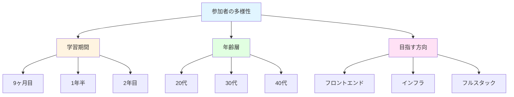
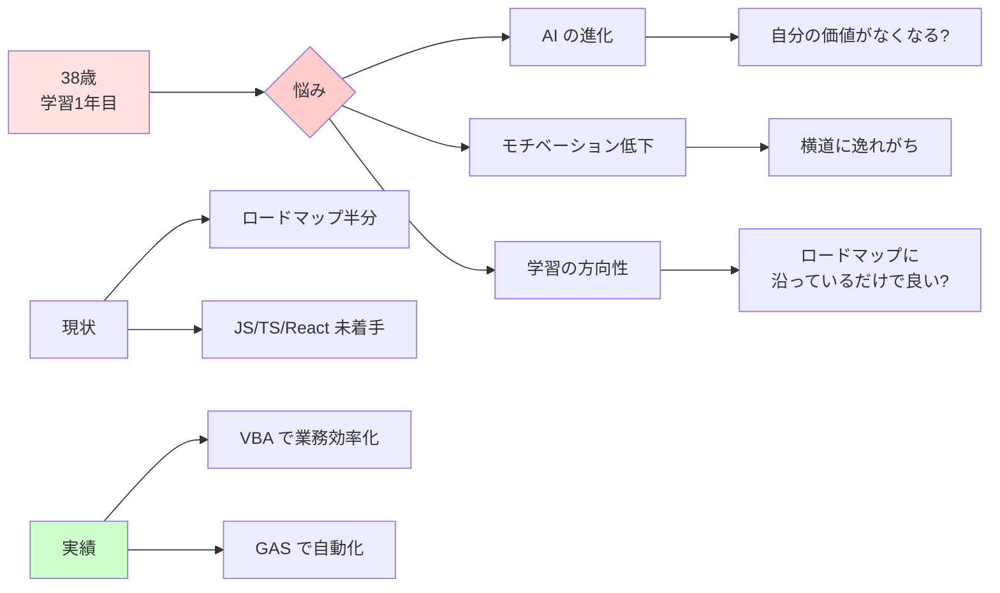
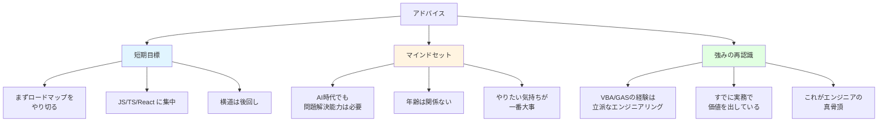
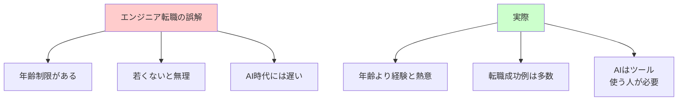
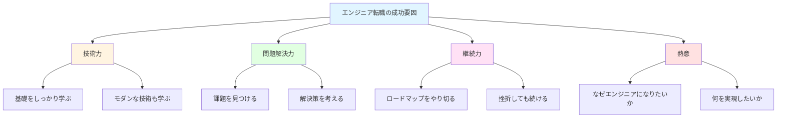
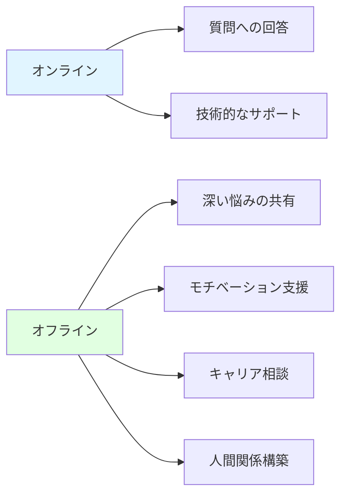
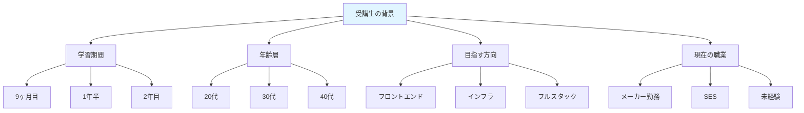
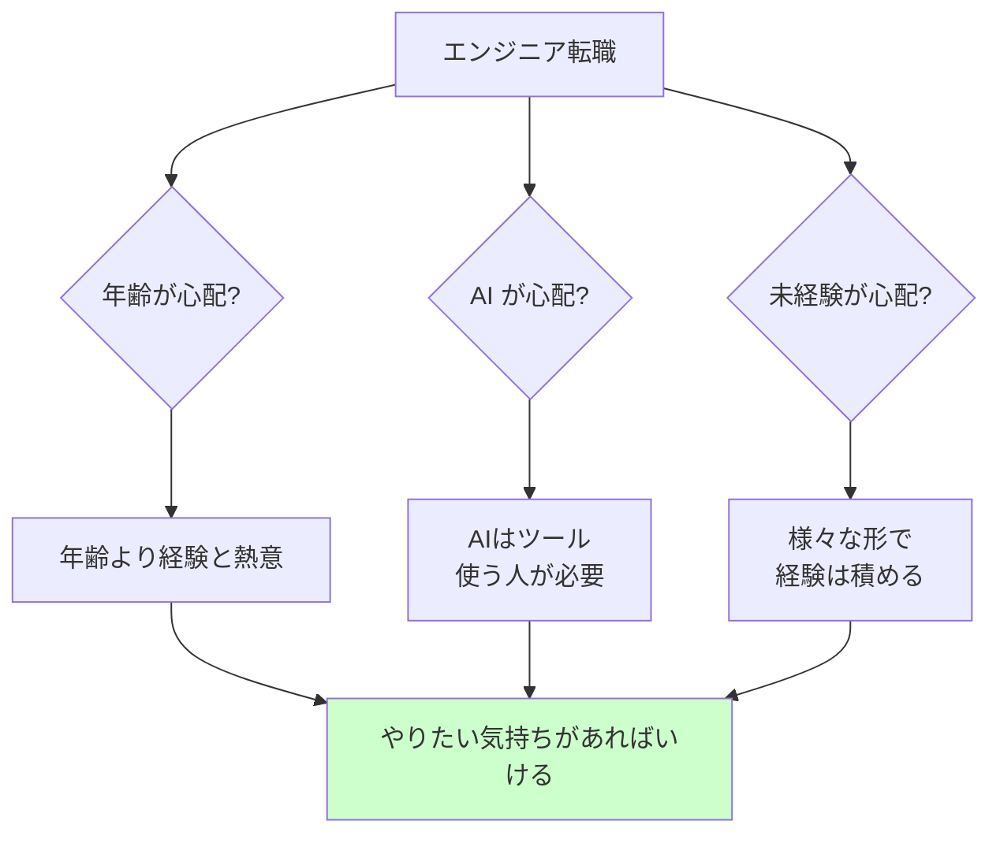

# はじめに

プログラミングスクールのメンターとして活動する中で、初めてオフライン・ミートアップに参加しました。

そこで出会った受講生の一人（38 歳、学習 1 年目）から、こんな相談を受けました。

> 「38 歳からプログラミングを始めるのは遅いですか？」
> 「AI の時代にエンジニアを目指すのは無謀ですか？」

**答えは明確です。全然遅くない！**

本記事では、約 1.5 時間に渡る対話を通じて感じた「年齢・AI 時代とプログラミング学習」について、プログラミング初心者の皆さんに伝えたいことをまとめます。

# ミートアップで出会った人たち

## 様々なバックグラウンドの受講生たち

ミートアップには、様々なバックグラウンドを持つ受講生が参加していました。

### 印象的だった受講生たち

- **学習 9 ヶ月目の方**: インフラに力を入れており、コミュニティイベントにも積極的に参加
- **学習 1 年半の方**: SES から大手企業への転職に成功
- **学習 2 年目の方**: 卒業生の紹介で転職成功。「好き」を仕事にしたいという明確なビジョンを持つ

一人ひとりが異なる目標に向かって、それぞれのペースで学習を続けていました。

# 38 歳からプログラミングを始める方との対話

## 最初の相談

その方からは、こんな言葉も聞かれました。

> 「最近 AI の進化やモチベーションの低下で悩んでいて、エンジニア転職を諦めかけています」

この言葉を聞いて、まずは話をじっくり聞くことにしました。

## その方の状況

話を聞いてみると、以下のような状況でした。

### 悩みのポイント

1. **AI の進化**: ChatGPT などの AI の進化を見て、「今からエンジニアを目指しても遅いのでは？」という不安
2. **学習の迷い**: 横道に逸れがちで、ロードマップに沿っているだけで良いのか不安
3. **進捗状況**: まだロードマップの半分くらいで、JavaScript・TypeScript・React がまだ未着手

### 実は持っていたスキル

さらに話を深掘りすると、その方には**すでにエンジニア的な素養**がありました。

- **VBA を駆使**: 職場での作業効率化を実現
- **GAS を活用**: 自動化を積極的に進めている
- **問題解決志向**: 課題を見つけて自ら解決策を実装

## メンターからのアドバイス

### 1. まずはロードマップをやり切る

まだ JavaScript・TypeScript・React が未着手とのことだったので、**それをまずやり切ることを勧めました**。

横道に逸れるのは悪いことではありませんが、まずは基礎を固めることが大切です。React まで到達すれば、モダンなフロントエンド開発の全体像が見えてきます。

### 2. すでにエンジニアの素養がある

「VBA や GAS を駆使して職場での作業効率化や自動化を進めている」

これを聞いた瞬間、**まさにエンジニアの真骨頂を見た**と思いました。

エンジニアリングの本質は：

- 課題を見つける
- 解決策を考える
- 実装する
- 価値を届ける

その方はすでにこのサイクルを回しています。言語や技術スタックが違うだけで、**本質的なエンジニアリング能力はすでに持っている**のです。

### 3. AI 時代だからこそ必要なスキル

AI が進化しても、以下のスキルは変わらず重要です。

| スキル     | 説明                   | その方の状況          |
| ---------- | ---------------------- | --------------------- |
| 問題発見力 | 課題を見つける能力     | ✅ 職場の非効率を発見 |
| 問題解決力 | 解決策を考える能力     | ✅ VBA/GAS で実装     |
| 実装力     | 実際にコードを書く能力 | ✅ 自動化を実現       |
| 価値提供   | ユーザーに価値を届ける | ✅ 業務効率化を達成   |

AI はツールの一つに過ぎません。これらの能力を持っている人が、AI を使いこなして更に大きな価値を生み出せるのです。

## 1.5 時間の熱い対話

気づけば、**1.5 時間くらい話していました**。

最初は不安そうな表情だったその方が、話の終わりには前向きな表情に変わっていたのが印象的でした。

# エンジニア転職に年齢は関係ない

## よくある誤解

### 誤解 1: 「30 代後半は遅い」

**これは完全な誤解です。**

今回のミートアップでも：

- 38 歳の方が学習中
- 様々な年齢層の人が転職成功

年齢よりも、**何を学び、何を実現したいか**の方が重要です。

### 誤解 2: 「AI 時代にはエンジニアは不要」

**AI はツールであり、使う人が必要です。**

AI ができること：

- コード生成
- バグ修正の提案
- ドキュメント生成

AI ができないこと：

- ビジネス課題の発見
- アーキテクチャの設計
- ユーザーとのコミュニケーション
- 価値判断

**課題を見つけて解決策を実装できる人**こそ、AI 時代に必要とされる人材です。

### 誤解 3: 「未経験からは厳しい」

**実務での経験は様々な形であります。**

例えば：

- VBA での業務効率化 → プログラミング経験
- GAS での自動化 → クラウドサービス連携経験
- 職場での課題解決 → エンジニアリング思考

これらは立派な**実務経験**です。

## エンジニア転職に必要なもの

### 1. 技術力（学習を継続する力）

- ロードマップに沿って基礎を固める
- 手を動かしてコードを書く
- モダンな技術にもキャッチアップ

### 2. 問題解決力

- 課題を見つける目
- 解決策を考える思考力
- 実装して価値を届ける実行力

### 3. 継続力

- 挫折しても諦めない
- 横道に逸れても戻ってくる
- ゴールを見失わない

### 4. 熱意

- なぜエンジニアになりたいか
- 何を実現したいか
- 誰のために価値を届けたいか

**この 4 つがあれば、年齢は関係ありません。**

# メンターとしての学び

今回のミートアップで、メンターとしても多くの学びがありました。

## 対面の重要性

オンラインでのメンタリングも重要ですが、対面だからこそ：

- 深い悩みを聞ける
- 表情や雰囲気から本音を感じ取れる
- 熱量を伝えられる

## 受講生の多様性

一人ひとりが異なる背景を持ち、異なる目標に向かって学習しています。

**画一的なアドバイスではなく、その人に合った支援が必要**だと改めて感じました。

## 技術だけではない価値

エンジニアリングは技術だけではありません。

- **課題発見**: どんな問題を解決するか
- **価値提供**: 誰のためにどんな価値を届けるか
- **継続**: 挫折してもやり続ける力

VBA や GAS で**すでに価値を提供している人**は、あとは技術スタックを広げるだけです。

# まとめ

## プログラミング初心者の皆さんへのメッセージ

もしこの記事を読んで、少しでも不安を感じている方がいたら、改めて伝えたいです。

> **全然いける！迷ってるなら今日から始めよう！**

- すでに持っているスキルが必ず活きる
- 年齢は関係ない
- AI 時代だからこそ、問題解決能力が重要
- まずは基礎をやり切ろう

## 行動を起こそう

- **年齢は関係ない**: やりたい気持ちと継続力があれば、何歳でも大丈夫
- **AI は味方**: 問題解決能力があれば、AI を使いこなせる
- **経験は積める**: 今の仕事でも、学習でも、実務経験は積める

## メンターとして

今回のミートアップで、受講生の皆さんから多くのエネルギーをもらいました。

- それぞれの目標に向かって頑張っている姿
- 困難に直面しても諦めない姿勢
- 仲間同士で刺激し合う雰囲気

**これからも、一人ひとりの成長をサポートしていきたい**と思います。

---

プログラミング学習を始めようか迷っている方、すでに学習中だけど不安を感じている方の参考になれば幸いです。

年齢も AI も関係ない。やりたい気持ちがあれば、必ず道は開けます。

質問やフィードバックがあれば、コメントでお知らせください。

**一緒に頑張りましょう！**
