# はじめに

Web サービスで動画や画像などの大容量ファイルを配信していると、「データ転送料が高い...」という悩みに直面することがあります。

本記事では、Cloudflare R2 を使ったコスト削減の方法を、**初心者の方でも理解できるように**基礎から丁寧に解説します。

## この記事で分かること

- オブジェクトストレージと CDN の基礎知識
- なぜデータ転送料が高くなるのか
- Cloudflare R2 がコスト削減に効果的な理由
- 実際の移行手順とポイント

## 想定読者

- Web サービスで画像・動画配信をしている方
- クラウドのコストが気になっている方
- インフラの基礎を学びたい方

# 基礎知識

まずは、ファイル配信の仕組みとコストの基礎から理解しましょう。

## オブジェクトストレージとは

**オブジェクトストレージ**は、ファイル（画像、動画、PDF など）をクラウド上に保存できるサービスです。

代表的なサービス：

- AWS S3（Amazon Web Services）
- Google Cloud Storage
- Azure Blob Storage

### 料金の仕組み

オブジェクトストレージの料金は、主に以下の 2 つで構成されています。

| 料金項目           | 説明                             | 料金の目安            |
| ------------------ | -------------------------------- | --------------------- |
| **ストレージ料金** | ファイルを保存するための費用     | 1GB あたり月額 2-3 円 |
| **データ転送料**   | ファイルをダウンロードする際の費用 | 1GB あたり 9-12 円    |

:::message
**重要ポイント**: ファイルを保存するだけなら安いですが、**ダウンロードされるたびに高額な料金が発生**します！
:::

## CDN（Content Delivery Network）とは

**CDN** は、世界中に配置されたサーバーネットワークを使って、ユーザーに近い場所からファイルを配信する仕組みです。

### CDN を使うメリット

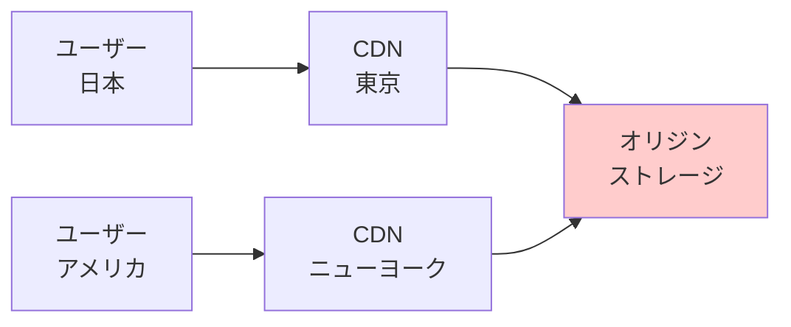

- **高速配信**: ユーザーに近いサーバーから配信されるため、表示が速い
- **安定性向上**: 複数のサーバーに負荷を分散できる
- **効率的**: 一度取得したファイルをキャッシュ（一時保存）して再利用

### 従来の構成と課題

多くのサービスでは、以下のような構成を使っています。

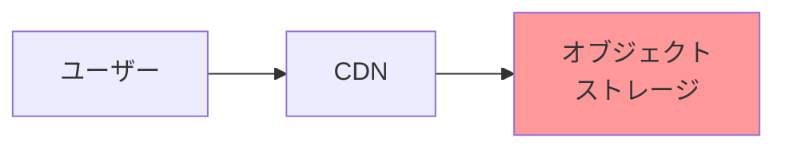

**課題**: CDN からユーザーへのデータ転送料が**使った分だけ課金される**ため、高額になりがちです！

### 具体例：どれくらいコストがかかるのか

動画配信サービスを例に、実際の金額を見てみましょう。

- 動画ファイル: 100MB
- 月間再生回数: 10,000 回
- データ転送量: 100MB × 10,000 回 = 1TB

**従来型のコスト（概算）**

- データ転送料: 1,000GB × 10 円/GB = **約 10,000 円/月**

つまり、動画が再生されればされるほど、コストも比例して増え続けます。

## Cloudflare R2 とは

**Cloudflare R2** は、Cloudflare が提供するオブジェクトストレージサービスです。

### 最大の特徴：データ転送料が無料！

| 項目                     | 従来型                 | Cloudflare R2     |
| ------------------------ | ---------------------- | ----------------- |
| ストレージ料金           | 1GB あたり 2-3 円      | 1GB あたり 1.5 円 |
| データ転送料（Egress）※ | **1GB あたり 9-12 円** | **無料！**        |

※Egress = ストレージからユーザーへのデータ送信

:::message alert
**重要**: R2 からユーザーへのデータ転送料が**完全無料**です！これが最大のメリットです。
:::

### なぜ無料にできるのか

Cloudflare は、CDN 事業で既に世界中にサーバーネットワークを持っています。
そのため、自社ネットワーク内でデータを配信するコストが極めて低く、転送料を無料にできるのです。

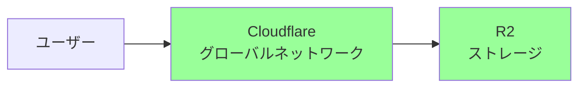

# 従来型 vs Cloudflare R2 の比較

## よくある課題

大容量ファイル（動画、画像、PDF など）を配信する際、以下のような課題が発生します。

- **コストの増大**: データ転送量に応じて料金が増えるため、人気が出るほどコストも増える
- **スケーラビリティの問題**: サービスが成長するほど、比例してコストも増加してしまう
- **予測の難しさ**: アクセス数の変動により、月々のコストを予測しづらい

## コスト比較シミュレーション

先ほどの動画配信サービスの例で比較してみましょう。

### 前提条件

- 動画ファイル: 100MB
- 月間再生回数: 10,000 回
- 総データ転送量: 1TB/月
- 総ストレージ容量: 100GB

### 従来型（例：AWS CloudFront + S3）

| 項目           | 計算            | 金額             |
| -------------- | --------------- | ---------------- |
| ストレージ料金 | 100GB × 2.5 円  | 250 円           |
| データ転送料   | 1,000GB × 10 円 | **10,000 円**    |
| **合計**       |                 | **10,250 円/月** |

### Cloudflare R2

| 項目           | 計算           | 金額          |
| -------------- | -------------- | ------------- |
| ストレージ料金 | 100GB × 1.5 円 | 150 円        |
| データ転送料   | 1,000GB × 0 円 | **0 円**      |
| **合計**       |                | **150 円/月** |

:::message
**削減効果**: 月額で約 10,000 円の削減 → **年間で約 120,000 円のコスト削減**が可能です！
:::

### グラフで見る成長とコスト

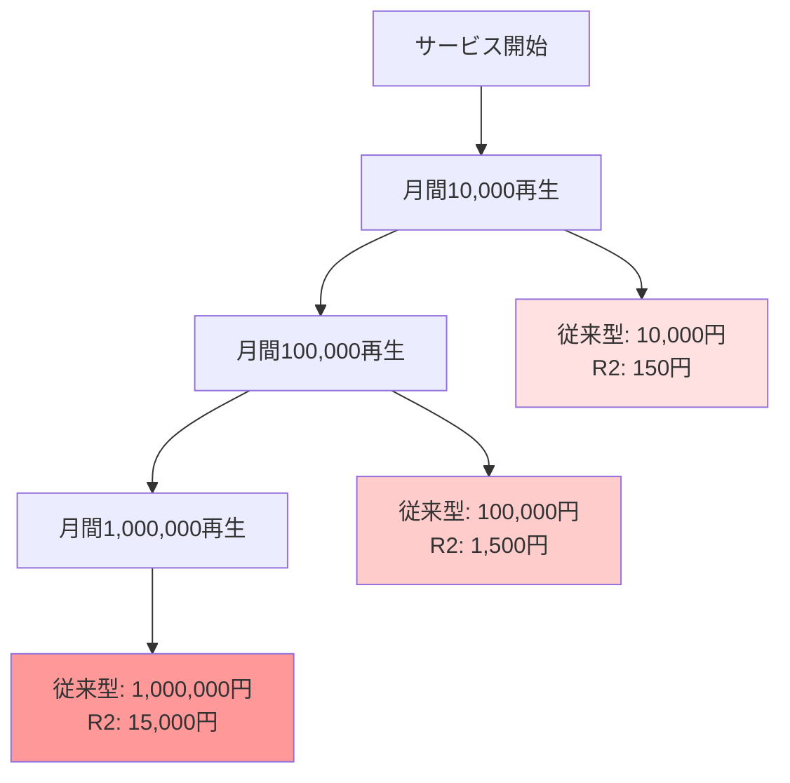

サービスが成長するほど、コストの差がさらに大きくなっていきます！

# Cloudflare R2 への移行手順

ここからは、実際に R2 へ移行する手順を、初心者の方にも分かりやすく解説します。

## 全体の流れ

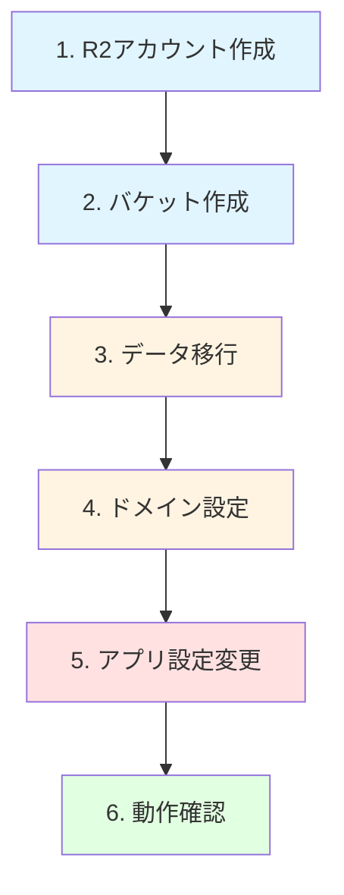

## ステップ 1: Cloudflare アカウントの作成

1. [Cloudflare](https://www.cloudflare.com/) にアクセス
2. 無料アカウントを作成
3. R2 を有効化（無料枠あり）

:::message
**R2 の無料枠**

- ストレージ: 10GB/月
- データ転送（Egress）: 無制限・無料
- API リクエスト: 100 万回/月
  :::

## ステップ 2: バケットの作成

**バケット**とは、ファイルを保存するための「入れ物」のことです（フォルダのようなイメージ）。

1. Cloudflare ダッシュボードから R2 を選択
2. 「Create Bucket」をクリック
3. バケット名を入力（例: `my-media-files`）
4. リージョンを選択（自動がおすすめ）

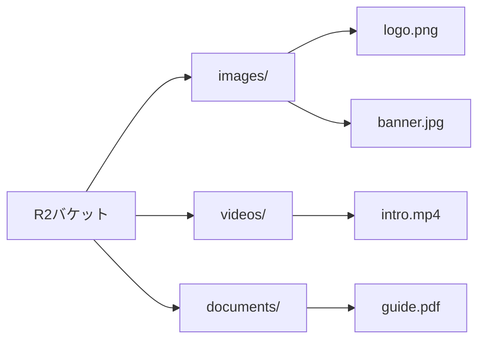

## ステップ 3: データの移行

既存のストレージから R2 へファイルをコピーします。主に 3 つの方法があります。

### 方法 1: Super Slurper（初心者におすすめ）

Cloudflare が提供する、GUI で操作できる移行ツールです。

1. R2 ダッシュボードから「Import Data」を選択
2. 既存ストレージの認証情報を入力
3. コピー開始

**メリット**:

- GUI（画面）で簡単に操作できる
- 大量のファイルも並列処理で高速にコピー
- 移行中も既存システムは通常通り動作するので安心

### 方法 2: CLI ツール

```bash
# AWS CLI を使った例
aws s3 sync s3://existing-bucket/ r2://my-r2-bucket/
```

### 方法 3: Sippy（自動同期）

**Sippy** は、既存ストレージと R2 を自動同期する機能です。

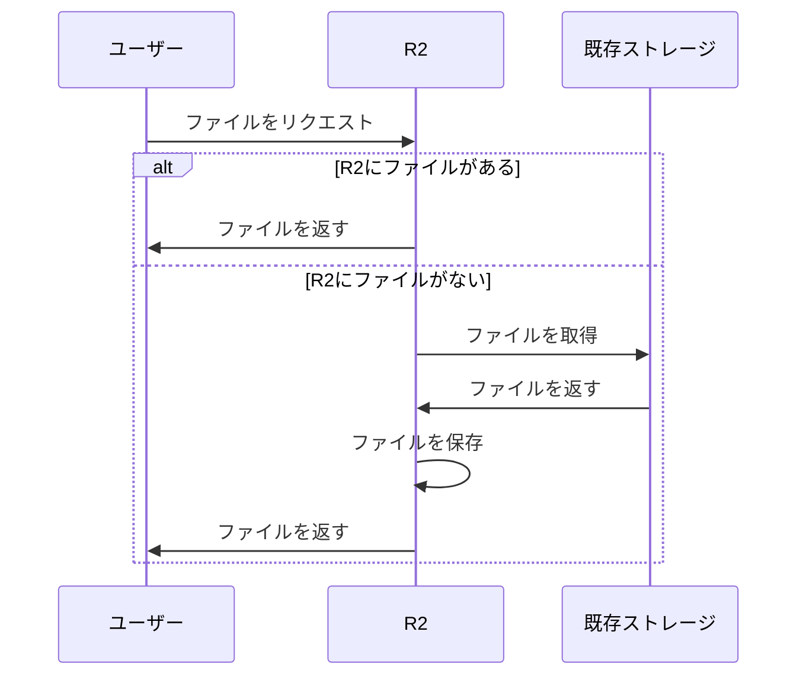

**メリット**:

- 段階的に移行できるため安全
- R2 にないファイルは既存ストレージから自動で取得してくれる
- 万が一の問題が起きても影響が少ない

## ステップ 4: カスタムドメインの設定

R2 に独自ドメインを設定します。これにより、`https://media.example.com`のような独自の URL でファイルにアクセスできます。

### 設定例

1. Cloudflare DNS で CNAME レコードを追加

   - 名前: `media.example.com`
   - ターゲット: R2 バケットの URL

2. SSL 証明書を自動発行（Cloudflare が自動で行ってくれます）

3. アクセス確認
   ```
   https://media.example.com/images/logo.png
   ```

## ステップ 5: アプリケーションの設定変更

Web アプリケーション側で、ファイルの参照先 URL を R2 に変更します。

### Before（従来型）

```javascript
const imageUrl = "https://cdn.example.com/images/logo.png";
```

### After（R2）

```javascript
const imageUrl = "https://media.example.com/images/logo.png";
```

### 環境変数で管理（推奨）

```bash
# .env
MEDIA_URL=https://media.example.com
```

```javascript
const imageUrl = `${process.env.MEDIA_URL}/images/logo.png`;
```

このようにすることで、環境変数を変更するだけで簡単に切り替えできます。

## ステップ 6: 動作確認

移行後は、必ず以下の項目を確認しましょう。

### 確認項目チェックリスト

- [ ] 画像が正しく表示されるか
- [ ] 動画が正常に再生できるか
- [ ] PDF などのファイルがダウンロードできるか
- [ ] 表示速度に問題がないか
- [ ] アクセス制御が意図通り機能しているか
- [ ] エラーが発生していないか

# 段階的な移行戦略

安全に移行するためには、いきなり本番環境を変更するのではなく、段階的に進めることが重要です。

## 移行の 3 ステップ

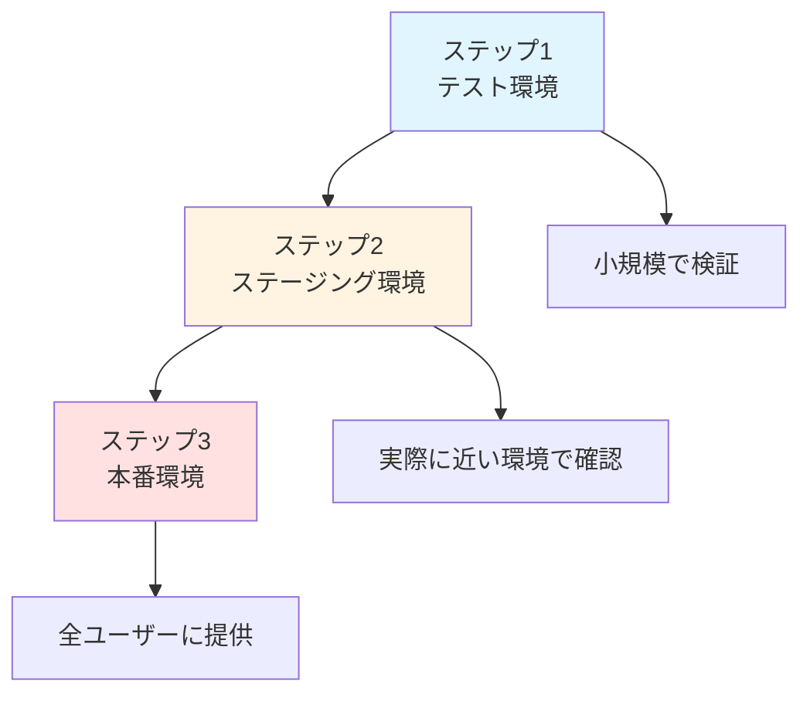

## ステップ 1: テスト環境で試す

まずは影響の小さいテスト環境で試してみましょう。

### やること

1. テスト用の R2 バケットを作成
2. 少量のファイルをアップロード
3. アクセスできることを確認

### 確認ポイント

- [ ] ファイルが正しくアップロードされているか
- [ ] URL でアクセスできるか
- [ ] 画像・動画が正常に表示/再生できるか

## ステップ 2: ステージング環境で検証

本番に近い環境で、より本格的に検証します。

### やること

1. 本番と同じ構成で R2 を設定
2. 本番データの一部をコピー
3. アプリケーションから接続テスト

### 確認ポイント

- [ ] パフォーマンスが問題ないか
- [ ] エラーが発生しないか
- [ ] アクセス制御が機能するか

## ステップ 3: 本番環境へ展開

十分に検証できたら、本番環境へ展開します。

### やること

1. 本番用 R2 バケットを作成
2. 全データを移行
3. アプリケーションの設定を切り替え
4. 監視を強化

### 注意点

- 最初は一部のユーザーだけに公開する（カナリアリリース）
- 問題が起きた場合、すぐに元に戻せるようにしておく
- 移行後も数日間はエラーが起きていないか監視を継続する

# よくある質問（FAQ）

## Q1: 既存のストレージは削除していいの？

**A: いいえ、すぐには削除しないでください。**

移行後も 1〜2 週間は既存ストレージを残しておきましょう。
問題が起きたときに、すぐに戻せるようにするためです。

## Q2: R2 は AWS S3 と互換性があるの？

**A: はい、S3 API と互換性があります。**

既存の S3 用のツールやライブラリがそのまま使えるので、移行が簡単です。

```javascript
// AWS SDK を使った例（R2でも動く）
import { S3Client } from "@aws-sdk/client-s3";

const client = new S3Client({
  endpoint: "https://your-account.r2.cloudflarestorage.com",
  credentials: {
    accessKeyId: "YOUR_ACCESS_KEY",
    secretAccessKey: "YOUR_SECRET_KEY",
  },
});
```

## Q3: 無料枠を超えたらどうなるの？

**A: 自動的に有料プランに移行します。**

料金体系：

- ストレージ: 1GB あたり 1.5 円/月
- データ転送（Egress）: **無料**
- API リクエスト: 100 万回を超えると、100 万回あたり 36 円

:::message
無料枠（10GB）を超えて有料プランになっても、従来型と比べて大幅に安価です！
:::

## Q4: 移行にかかる時間は？

**A: データ量によりますが、意外と早いです。**

目安：

- 10GB: 数分〜10 分程度
- 100GB: 30 分〜1 時間程度
- 1TB: 数時間〜半日程度

Super Slurper を使えば、並列処理で高速にコピーされます。

## Q5: アクセス制限は設定できるの？

**A: はい、Cloudflare Workers で実装できます。**

詳しくは後述の「アクセス制御の実装」を参照してください。

# 応用編: アクセス制御の実装

公開したくないファイルには、アクセス制限をかけることができます。

## Cloudflare Workers とは

**Cloudflare Workers** は、CDN のエッジ（ユーザーに近い場所）で動作する軽量なプログラムです。

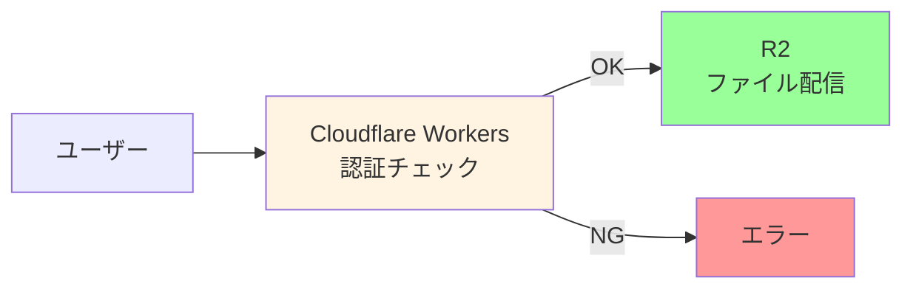

## 基本的な実装例

### パターン 1: トークン認証

```javascript
addEventListener("fetch", (event) => {
  event.respondWith(handleRequest(event.request));
});

async function handleRequest(request) {
  // URLパラメータからトークンを取得
  const url = new URL(request.url);
  const token = url.searchParams.get("token");

  // トークンが正しいかチェック
  if (token === "your-secret-token") {
    // OKなら元のリクエストを実行
    return fetch(request);
  } else {
    // NGならエラーを返す
    return new Response("Unauthorized", {
      status: 401,
      headers: { "Content-Type": "text/plain" },
    });
  }
}
```

**使い方**:

```
https://media.example.com/video.mp4?token=your-secret-token
```

### パターン 2: 有効期限付き URL

```javascript
async function handleRequest(request) {
  const url = new URL(request.url);
  const expires = url.searchParams.get("expires");
  const signature = url.searchParams.get("sig");

  // 有効期限をチェック
  const now = Math.floor(Date.now() / 1000);
  if (parseInt(expires) < now) {
    return new Response("Link expired", { status: 403 });
  }

  // 署名をチェック（簡易版）
  const expectedSig = await generateSignature(url.pathname, expires);
  if (signature !== expectedSig) {
    return new Response("Invalid signature", { status: 403 });
  }

  return fetch(request);
}

async function generateSignature(path, expires) {
  const secret = "your-secret-key";
  const message = `${path}${expires}${secret}`;
  // 実際はHMAC-SHA256などを使用
  return btoa(message).substring(0, 20);
}
```

**メリット**:

- URL に有効期限を設定できる（例：24時間後に無効化）
- ユーザーに一時的なアクセス権を安全に付与できる

# トラブルシューティング

移行時によくある問題と、その解決方法をまとめました。

## 問題 1: ファイルが表示されない

### 考えられる原因

- URL が間違っている
- バケットの公開設定が正しくない
- CORS（クロスオリジン）の設定が不足している

### 解決方法

1. URL を確認

   ```
   正: https://media.example.com/images/logo.png
   誤: https://media.example.com//images/logo.png (スラッシュが2つ)
   ```

2. バケットを公開に設定

   - R2 ダッシュボードで「Public Access」を有効化

3. CORS 設定を追加
   ```json
   {
     "AllowedOrigins": ["https://example.com"],
     "AllowedMethods": ["GET"],
     "AllowedHeaders": ["*"]
   }
   ```

## 問題 2: レスポンスが遅い

### 考えられる原因

- キャッシュが効いていない
- ファイルサイズが大きすぎる

### 解決方法

1. キャッシュヘッダーを設定

   ```javascript
   // Workersでキャッシュを制御
   const response = await fetch(request);
   response.headers.set("Cache-Control", "public, max-age=86400");
   return response;
   ```

2. ファイルサイズを最適化
   - 画像を圧縮する
   - 動画をストリーミング形式に変換する

## 問題 3: コストが予想より高い

### 考えられる原因

- API リクエスト数が多すぎる
- ストレージ容量が想定より大きい

### 解決方法

1. API リクエスト数を削減する

   - 不要なリクエストを削除する
   - キャッシュを活用して同じファイルへのリクエストを減らす

2. ストレージを最適化する
   - 不要なファイルを削除する
   - 重複しているファイルを見つけて削除する

# まとめ

## この記事で学んだこと

本記事では、Cloudflare R2 を使った大容量ファイル配信のコスト削減について解説しました。

### 重要ポイントのおさらい

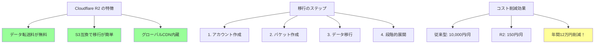

## Cloudflare R2 がおすすめな人

こんな方に特におすすめです：

| 状況                           | なぜ R2 がおすすめか         |
| ------------------------------ | ---------------------------- |
| 動画配信サービスを運営         | 大容量ファイルの転送料が無料 |
| 画像の多い EC サイト           | 商品画像の配信コストを削減   |
| グローバル展開を考えている     | 世界中で高速配信             |
| コストを抑えたいスタートアップ | 無料枠から始められる         |
| トラフィックが不安定           | 転送料無料でコスト予測が簡単 |

## 次のステップ

この記事を読んで「試してみたい！」と思った方へ、次のアクションプランを用意しました。

### 今すぐできること

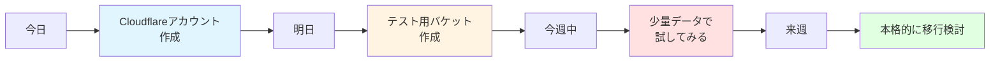

### ステップバイステップ

1. **まずは無料で試す**（所要時間: 15 分）

   - Cloudflare アカウント作成
   - R2 を有効化
   - テスト用バケット作成

2. **小さく始める**（所要時間: 30 分）

   - 数枚の画像をアップロード
   - URL でアクセスできるか確認
   - パフォーマンスをチェック

3. **効果を測定する**（所要時間: 1 時間）

   - 現在のコストを計算
   - R2 移行後のコストを試算
   - 削減額を確認

4. **段階的に拡大**（所要時間: 数日〜数週間）
   - テスト環境で検証
   - ステージング環境へ展開
   - 本番環境へ移行

## よくある懸念と回答

移行を検討する際の懸念点にお答えします。

### 「技術的に難しそう...」

**→ 大丈夫です！初心者でも移行できます**

- GUI（画面操作）で簡単に操作できる
- 本記事の手順に沿って進めればOK
- AWS S3 を使ったことがあれば、ほぼ同じ操作感

### 「既存システムに影響が出ないか心配...」

**→ 段階的移行なので安全です！**

- まずはテスト環境から始められる
- 既存システムは残したまま並行運用できる
- 問題があればいつでも元に戻せる

### 「本当にコスト削減できるの？」

**→ 数字で確認できます！**

- 現在の請求書を確認してみてください
- データ転送料（Egress）の項目をチェック
- R2 に移行すれば、その費用が **0 円** になります

### 「無料枠で足りるかな？」

**→ まずは無料で試してみましょう！**

- 無料枠: ストレージ 10GB、データ転送は無制限
- 個人プロジェクトや小規模サービスなら十分
- 無料枠を超えても、従来型より圧倒的に安い

## 参考資料

さらに詳しく学びたい方は、以下の公式ドキュメントをご覧ください。

### 公式ドキュメント

- [Cloudflare R2 公式サイト](https://www.cloudflare.com/ja-jp/developer-platform/r2/)
- [R2 料金ページ](https://www.cloudflare.com/ja-jp/developer-platform/r2/pricing/)
- [Cloudflare Workers ドキュメント](https://developers.cloudflare.com/workers/)

### 関連技術の学習リソース

- AWS S3 との互換性について
- CDN の仕組みと活用方法
- オブジェクトストレージの基礎知識

## 最後に

データ転送コストは、サービスが成長すればするほど大きな負担になっていきます。

**Cloudflare R2 は、その課題を根本から解決できるサービスです。**

### 実際の効果（再掲）

| 再生回数        | 従来型コスト | R2 コスト | 削減額         |
| --------------- | ------------ | --------- | -------------- |
| 月 10,000 回    | 10,000 円    | 150 円    | **9,850 円**   |
| 月 100,000 回   | 100,000 円   | 1,500 円  | **98,500 円**  |
| 月 1,000,000 回 | 1,000,000 円 | 15,000 円 | **985,000 円** |

:::message alert
**年間で見ると、さらに大きな差になります！**
:::

### 今日から始めよう

迷っているなら、まずは無料で試してみることをおすすめします。

1. アカウント作成（約5分）
2. テストファイルをアップロード（約10分）
3. 効果を実感（プライスレス！）

**コスト削減は、今日から始められます。**

---

この記事が、あなたのサービスのコスト削減に役立てば幸いです。

質問や「こんな機能はあるの？」といった疑問があれば、ぜひコメントで教えてください。

一緒にコスト削減を実現しましょう！
