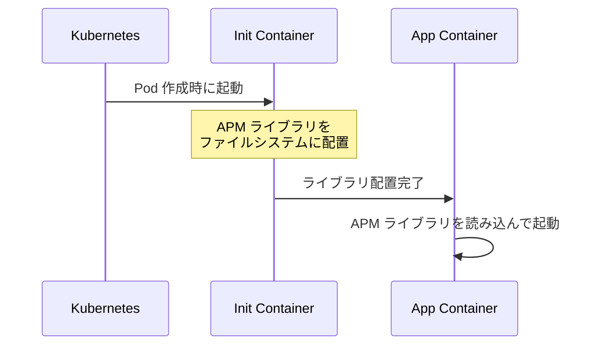
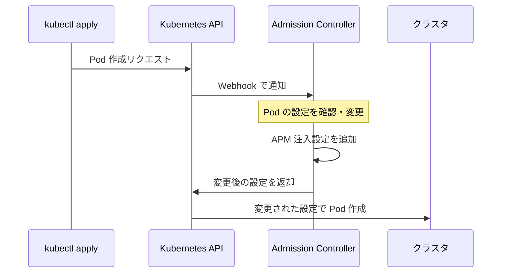
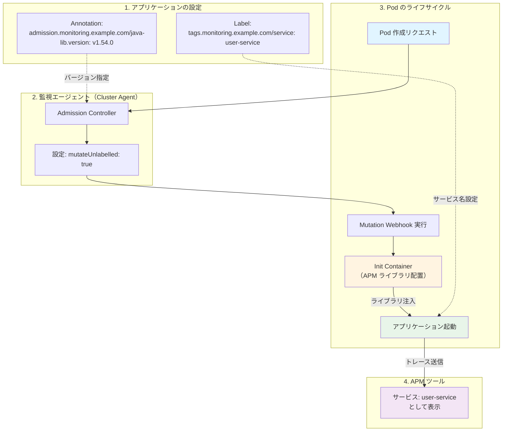

# はじめに

本記事では、Kubernetes 環境で動作するアプリケーションに対して、**APM（Application Performance Monitoring）ライブラリを自動注入する仕組み**について、初心者の方でも理解できるよう基礎から解説します。

実際の運用で直面した課題と、その解決方法を通じて、Kubernetes における監視設定の設計思想を学んでいきましょう。

## 前提知識：APM とは何か

**APM（Application Performance Monitoring）** とは、アプリケーションのパフォーマンスを監視するための技術です。

具体的には以下のような情報を収集・可視化します：

- リクエストの処理時間（レスポンスタイム）
- データベースへの問い合わせ時間
- 外部 API 呼び出しの処理時間
- エラーの発生状況
- 各処理の呼び出し関係（分散トレース）

これらの情報を取得するには、アプリケーションに **APM ライブラリ** を組み込む必要があります。

## Kubernetes における APM ライブラリ注入の 2 つの方式

Kubernetes 環境でアプリケーションに APM ライブラリを組み込む方法は、大きく分けて 2 つあります。

### 方式 1：エージェント側での一括自動注入

監視エージェント（APM ツールの管理コンポーネント）の設定で、「すべての Pod に APM ライブラリを自動注入する」方式です。

**メリット：**
- 設定が簡単（エージェント側の設定だけで完結）
- アプリケーション側の変更が不要

**デメリット：**
- 監視が不要な Pod にまでライブラリが注入されてしまう
- きめ細かい制御が難しい

### 方式 2：Admission Controller を使った個別注入

Kubernetes の **Admission Controller**（Pod 作成時に設定を変更できる仕組み）を利用して、必要な Pod のみに APM ライブラリを注入する方式です。

**メリット：**
- 必要な Pod だけに注入できる
- Pod ごとにバージョン管理が可能
- リソースの無駄を削減できる

**デメリット：**
- アプリケーション側に設定（Annotation/Label）が必要

今回は、**方式 1 から方式 2 への移行**を行いました。以下、具体的な課題と解決策を見ていきます。

## 移行前の設定と課題（Before）

### 元々の設定

監視エージェントの設定ファイルで、以下のように全 Pod に対して APM を自動適用していました。

```yaml
# 監視エージェントの設定
monitoring-agent:
  apm:
    instrumentation:
      enabled: true  # すべての Pod に APM を自動注入
      disabledNamespaces: ["kube-system", "monitoring"]  # 除外する Namespace
```

この設定により、指定した Namespace を除くすべての Pod に、自動的に APM ライブラリが注入されていました。

### 直面した 3 つの課題

#### 1. 過剰な適用

Kubernetes クラスタ内には、以下のような **監視が不要な Pod** も多数存在します：

- **コントローラー系**：定期実行されるバッチ処理など
- **運用ツール**：デプロイツール、ログ収集ツールなど
- **内部サービス**：キャッシュサーバー、メッセージキューなど

これらにまで APM が適用されると、不要なデータが大量に収集され、監視コストが増大します。

#### 2. リソースの無駄

APM ライブラリの注入は、**Init Container**（アプリケーション起動前に実行される準備用コンテナ）を使って行われます。



**問題点：**
- 不要な Pod でも Init Container が毎回起動する
- CPU・メモリ・ストレージを無駄に消費する
- Pod の起動時間が長くなる

#### 3. 制御の粗さ

Namespace 単位での除外設定しかできないため、以下のような細かい制御ができませんでした：

- 「この Deployment だけ APM を無効にしたい」
- 「このサービスだけ APM ライブラリのバージョンを変更したい」
- 「段階的に新バージョンを適用したい」

## 移行後の設定構成（After）

これらの課題を解決するため、**Admission Controller を使った個別注入方式**に移行しました。

### Admission Controller とは

**Admission Controller** は、Kubernetes で Pod やその他のリソースが作成される際に、**自動的に設定を変更・追加できる仕組み**です。



この仕組みを利用することで、**Pod ごとに APM の適用有無やバージョンを制御**できます。

### 設定 1：監視エージェント側（Admission Controller の有効化）

```yaml
# 監視エージェントの設定
monitoring-agent:
  cluster-agent:
    admissionController:
      enabled: true              # Admission Controller を有効化
      mutateUnlabelled: true     # ラベルなしの Pod も対象にする
```

**`mutateUnlabelled: true` の意味：**

通常、Admission Controller は特定のラベルが付いた Pod のみを処理対象とします。しかし、`mutateUnlabelled: true` を設定することで、**Annotation（後述）が付いている Pod であれば、ラベルがなくても処理対象**になります。

### 設定 2：アプリケーション側（Deployment への Annotation/Label 追加）

アプリケーションのデプロイ設定（Deployment）に、以下の 2 つを追加します。

```yaml
apiVersion: apps/v1
kind: Deployment
metadata:
  name: my-application
spec:
  template:
    metadata:
      # 1. APM ライブラリの注入指示（Annotation）
      annotations:
        admission.monitoring.example.com/java-lib.version: "v1.54.0"
        # admission.monitoring.example.com/python-lib.version: "v3.16.2"
        # admission.monitoring.example.com/nodejs-lib.version: "v5.73.0"

      # 2. サービス名の明示的な指定（Label）
      labels:
        tags.monitoring.example.com/service: "user-service"
```

#### Annotation と Label の違い

| 項目 | Annotation | Label |
|------|-----------|-------|
| 用途 | 設定や指示を記載 | 識別・選択に使用 |
| 例 | ライブラリバージョン指定 | サービス名の指定 |
| Kubernetes の動作 | 直接影響しない | Selector で選択可能 |

#### なぜサービス名を Label で指定するのか

APM ツールは、トレース情報を **サービス名** でグループ化します。明示的に指定しないと、以下のような問題が起こります：

- すべてのアプリケーションが `app` や `default` という名前で表示される
- どのマイクロサービスのトレースか判別できなくなる

Label で `tags.monitoring.example.com/service: "user-service"` を指定すると、APM ツール上で **"user-service"** という名前で正しく識別されます。

## 全体の動作フロー

移行後の APM ライブラリ注入は、以下のように動作します。



### ステップ解説

1. **Pod 作成リクエスト**
   - `kubectl apply` などで Deployment が作成される

2. **Admission Controller が介入**
   - Kubernetes API が Pod 作成前に Webhook で通知
   - Annotation を確認し、APM ライブラリ注入設定を追加

3. **Init Container 起動**
   - APM ライブラリをファイルシステムに配置

4. **アプリケーション起動**
   - Init Container が配置したライブラリを読み込む
   - Label で指定されたサービス名が環境変数に設定される

5. **トレース送信**
   - アプリケーションの処理状況が APM ツールに送信される

## 移行による 3 つのメリット

### 1. 過剰適用の防止

Annotation を付けた Pod だけに APM が適用されるため、以下が実現できます：

- **監視が必要なサービスのみ**に絞って APM を適用
- コントローラーや運用ツールには適用されない
- 監視コストとデータ量の削減

### 2. 管理の簡素化

各アプリケーションの Deployment（Helm Chart など）で設定を一元管理できます：

```yaml
# 開発環境では最新版を試す
annotations:
  admission.monitoring.example.com/java-lib.version: "v2.0.0-beta"

# 本番環境では安定版を使う
annotations:
  admission.monitoring.example.com/java-lib.version: "v1.54.0"
```

### 3. 正しいサービス識別

Label でサービス名を明示することで、APM ツール上で以下のように正しく表示されます：

```
❌ Before（デフォルト名）
- app
- api
- default

✅ After（明示的なサービス名）
- user-service
- order-service
- payment-service
```

マイクロサービスアーキテクチャでは、複数のサービス間でリクエストが連鎖します。各サービスが適切な名前で識別されることで、**どこで遅延が発生しているか**が一目でわかります。

## まとめ

本記事では、Kubernetes 環境における APM ライブラリ自動注入の仕組みと、運用上の設計思想について解説しました。

### 重要なポイント

1. **全体適用（方式 1）は簡単だが、無駄が多い**
   - 設定は楽だが、不要な Pod にまで適用されてしまう

2. **Admission Controller（方式 2）できめ細かく制御**
   - 必要な Pod だけに適用できる
   - リソースの最適化が可能

3. **Annotation と Label の使い分け**
   - Annotation：APM の有効化とバージョン指定
   - Label：サービス名の明示的な設定

### 応用可能な場面

この仕組みは APM に限らず、以下のような用途にも応用できます：

- サイドカーコンテナの自動注入（サービスメッシュなど）
- セキュリティポリシーの適用
- 環境変数の自動設定
- ログ転送設定の注入

Kubernetes の Admission Controller は、クラスタ全体の運用を自動化・最適化する強力な仕組みです。ぜひ活用してみてください。

## 参考

- Kubernetes 公式ドキュメント：[Admission Controllers](https://kubernetes.io/docs/reference/access-authn-authz/admission-controllers/)
- Kubernetes 公式ドキュメント：[Dynamic Admission Control](https://kubernetes.io/docs/reference/access-authn-authz/extensible-admission-controllers/)
