## はじめに

Kubernetes を使っていると、「この Pod はこのサーバーに配置したい」という要望が出てきます。

例えば、

- **運用ツール（ArgoCD や Datadog など）** → 安定したサーバーに配置したい
- **アプリケーション** → コストを抑えるためにスケールしやすいサーバーに配置したい

本記事では、**図やイラストを使って初心者向けに**、Pod を狙った場所に配置する方法を解説します。

:::message
**この記事でわかること**

- Kubernetes の Pod 配置の仕組み（Taint、Toleration、Affinity）
- 運用ツールとアプリケーションを分けて配置する具体的な方法
- なぜこの仕組みが必要なのか
  :::

## 前提知識：MNG と NodePool って何？

本記事では、Kubernetes のサーバー（Node）を 2 種類に分けて管理します。初めての方向けに、それぞれの特徴を説明します。

### MNG（マネージドノードグループ）とは

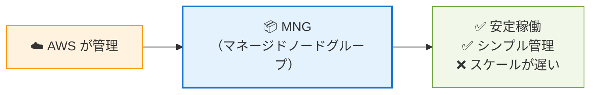

**MNG の特徴**

| 項目           | 説明                                                   |
| -------------- | ------------------------------------------------------ |
| **管理者**     | AWS（または他のクラウドプロバイダー）が管理           |
| **安定性**     | ✅ 高い。予測可能で安定したサーバー構成               |
| **スケール**   | ❌ 遅い。サーバーの起動に数分かかる                    |
| **コスト**     | 💰 一定。常に決まった数のサーバーが稼働               |
| **設定の柔軟性** | ❌ 低い。細かい設定変更が難しい                        |

**こんな用途に向いている**

- 運用ツール（ArgoCD、Datadog など）
- 常に動いている必要があるもの
- 安定稼働が最優先のもの

---

### NodePool（Karpenter）とは

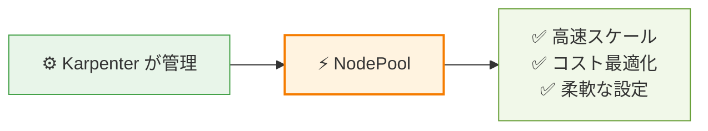

**NodePool の特徴**

| 項目           | 説明                                                     |
| -------------- | -------------------------------------------------------- |
| **管理者**     | Karpenter（Kubernetes 上で動くオートスケーラー）が管理  |
| **安定性**     | ⚠️ 中程度。必要に応じてサーバーが増減する               |
| **スケール**   | ✅ 速い。数秒〜数十秒でサーバーが起動                    |
| **コスト**     | 💰💰 最適化。負荷に応じてサーバー数が増減               |
| **設定の柔軟性** | ✅ 高い。YAML で細かく設定できる                         |

**こんな用途に向いている**

- アプリケーション（API、Web サーバーなど）
- 負荷が変動するもの
- コストを最適化したいもの

---

### MNG vs NodePool の比較

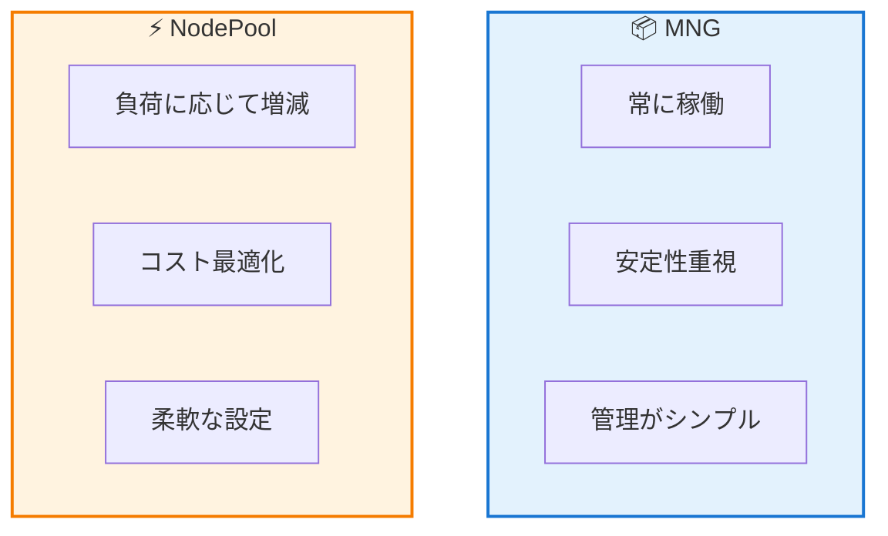

| 特徴               | 📦 MNG                       | ⚡ NodePool（Karpenter）       |
| ------------------ | ---------------------------- | ------------------------------ |
| **スケール速度**   | ❌ 遅い（数分）              | ✅ 速い（数秒〜数十秒）        |
| **コスト**         | 💰 一定                      | 💰💰 最適化（必要な分だけ）    |
| **安定性**         | ✅ 高い                      | ⚠️ 中程度                      |
| **設定の柔軟性**   | ❌ 低い                      | ✅ 高い                        |
| **向いている用途** | 運用ツール、常駐プロセス     | アプリケーション、バッチ処理   |

:::message info
**Karpenter とは？**
Karpenter は、Kubernetes クラスタのサーバー（Node）を自動で管理してくれるツールです。負荷に応じてサーバーを増やしたり減らしたりして、コストを最適化できます。
:::

---

## やりたいこと：Pod を 2 種類のサーバーに分ける

まず、やりたいことを図で見てみましょう。

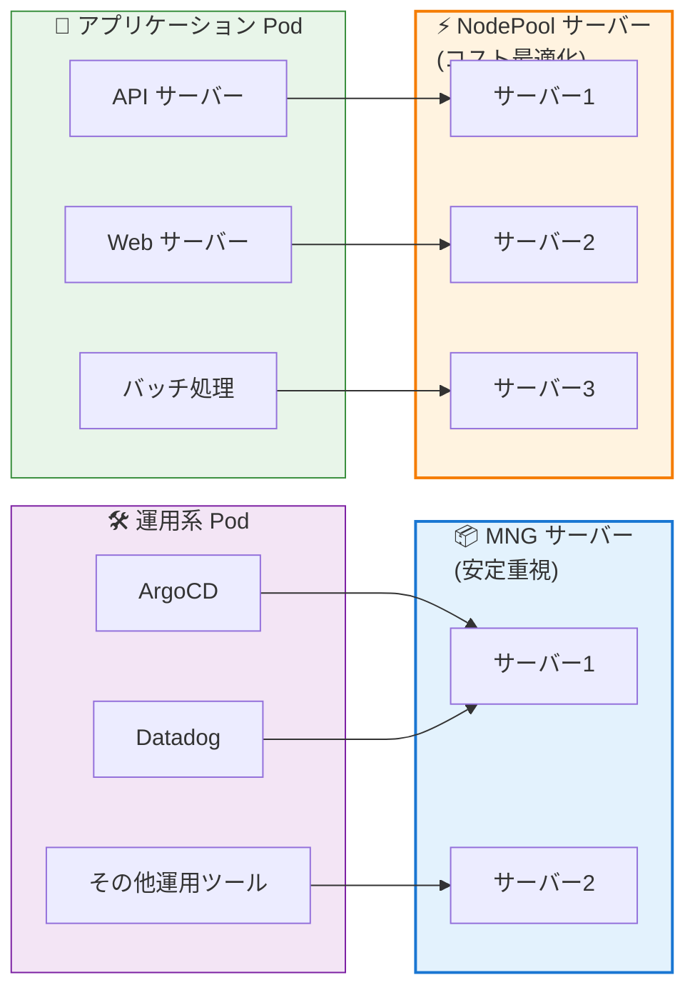

### 目的

| Pod の種類    | 配置先サーバー | 理由                               |
| ------------- | -------------- | ---------------------------------- |
| 🛠️ 運用系 Pod | MNG            | 安定稼働が重要。管理がシンプル。   |
| 🚀 アプリ Pod | NodePool       | スケールしやすく、コストを最適化。 |

### メリット

- **コスト削減**：アプリは必要に応じてサーバー数を増減できる
- **安定運用**：運用ツールは安定したサーバーで動かす
- **管理しやすい**：役割が明確で運用がシンプル

## 基礎知識：Pod 配置を制御する 3 つの仕組み

Kubernetes には、Pod を配置する場所を制御する 3 つの仕組みがあります。

### 1. Taint（テイント）：サーバー側の「立入禁止」看板

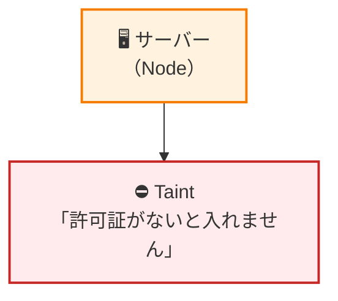

**Taint とは**

- サーバー（Node）に設定する「**立入禁止**」の看板
- 基本的に Pod は配置できない
- **許可証（Toleration）を持つ Pod だけ配置できる**

**例え話**
高級ホテルに「会員証がないと入れません」という看板があるイメージ。

---

### 2. Toleration（トレレーション）：Pod 側の「許可証」

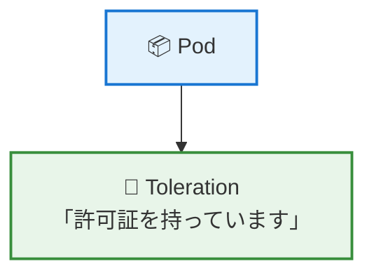

**Toleration とは**

- Pod に設定する「**許可証**」
- Taint がついたサーバーに**入ることができる**
- ただし、**必ずそこに配置されるわけではない**

**例え話**
会員証を持っていれば高級ホテルに入れるが、別の普通のホテルにも泊まれる。

---

### 3. Affinity（アフィニティ）：Pod 側の「希望・指定」

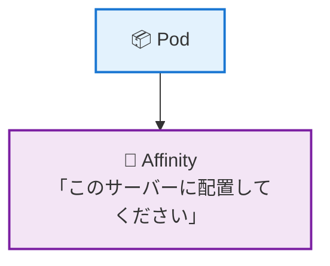

**Affinity とは**

- Pod に設定する「**配置希望・指定**」
- 「このサーバーに配置して」という意思表示
- **強制力がある**（`required` の場合）

**例え話**
「海が見える部屋に泊まりたい」という希望を出すイメージ。

---

## 3 つの仕組みの組み合わせ

この 3 つを組み合わせると、Pod を狙った場所に配置できます。

| 仕組み            | 設定場所         | 役割                               |
| ----------------- | ---------------- | ---------------------------------- |
| ⛔ **Taint**      | サーバー（Node） | 「立入禁止」看板                   |
| 🎫 **Toleration** | Pod              | 「許可証」（入ることができる）     |
| 📍 **Affinity**   | Pod              | 「ここに配置して」（強制的に指定） |

## 具体的な配置戦略

さて、ここから具体的に「どう設定するか」を見ていきましょう。

### 戦略の全体像

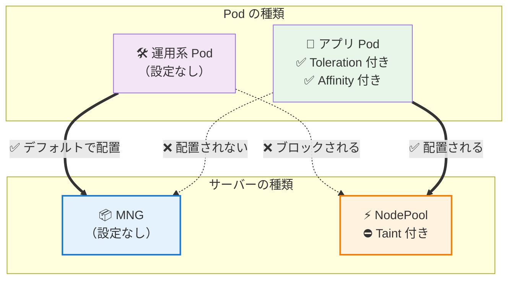

### 設定内容の比較表

| 対象                     | 設定内容                                 | 結果                      |
| ------------------------ | ---------------------------------------- | ------------------------- |
| 📦 **MNG サーバー**      | 設定なし                                 | 運用系 Pod が配置される   |
| ⚡ **NodePool サーバー** | ⛔ **Taint 付与**                        | アプリ Pod のみ配置される |
| 🛠️ **運用系 Pod**        | 設定なし                                 | MNG に配置される          |
| 🚀 **アプリ Pod**        | 🎫 **Toleration** + 📍 **Affinity** 付与 | NodePool に配置される     |

## 動作の仕組みを図で理解する

### パターン 1：運用系 Pod の動き

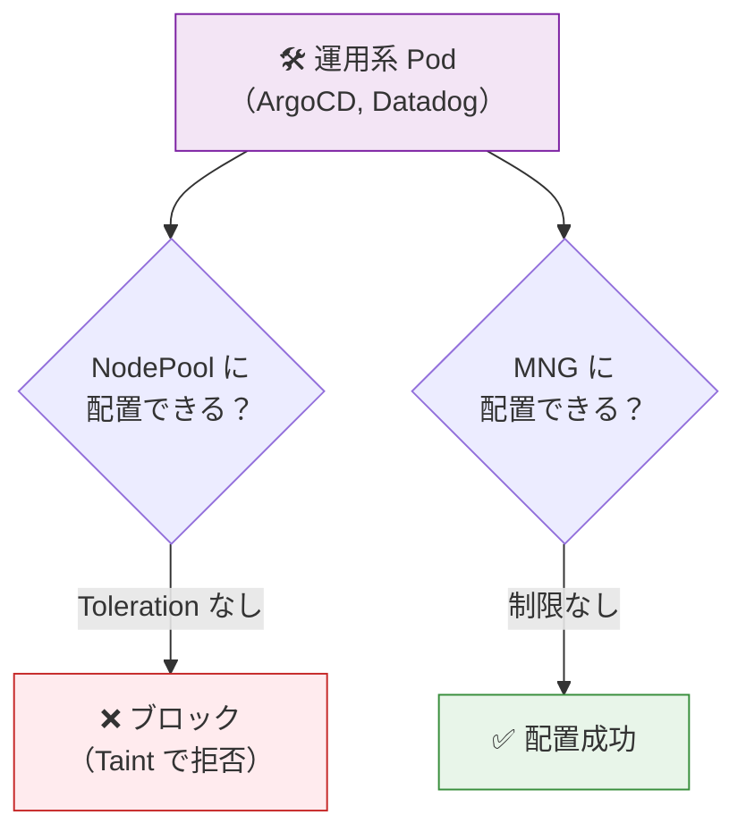

**運用系 Pod は MNG に配置される理由**

1. NodePool には **Taint** がついている → 許可証（Toleration）がないので ❌ ブロック
2. MNG には制限がない → ✅ そのまま配置される

---

### パターン 2：アプリ Pod の動き

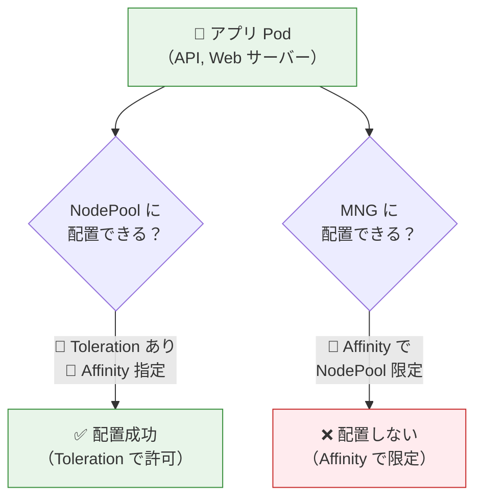

**アプリ Pod が NodePool に配置される理由**

1. NodePool の **Taint** を **Toleration** で突破 → ✅ 入ることができる
2. **Affinity** で NodePool を指定 → ✅ NodePool に限定される
3. MNG には **Affinity** の効果で配置されない → ❌ ブロック

---

## Toleration と Affinity の役割の違い

多くの人が混乱するポイントなので、図で整理しましょう。

### Toleration だけだと…

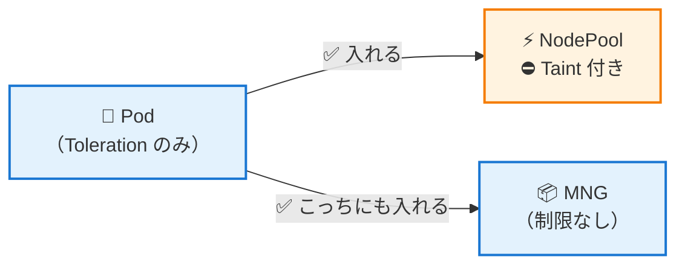

**問題点**

- Toleration は「**入ることができる**」という許可証
- でも「**そこに行く**」とは限らない
- MNG にも配置される可能性がある

---

### Toleration + Affinity だと…

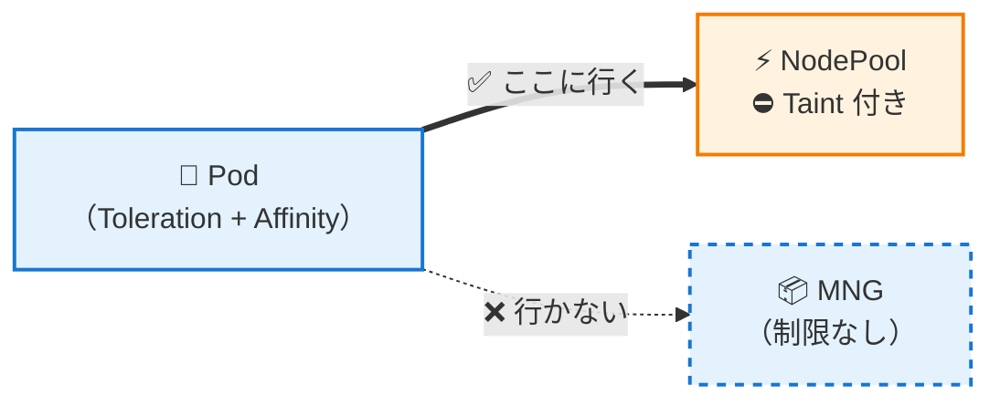

**解決**

- **Toleration**：NodePool に「**入れる**」
- **Affinity**：NodePool に「**行く**」ように指定
- MNG には配置されない

### 役割の比較表

| 仕組み         | 役割                                | 例え                           |
| -------------- | ----------------------------------- | ------------------------------ |
| 🎫 Toleration  | 「入ることができる」（許可）        | 会員証を持っている             |
| 📍 Affinity    | 「そこに行く」（指定・強制）        | 「この部屋に泊まる」と予約する |
| 両方組み合わせ | 「入れる」+「そこに行く」= 確実配置 | 会員証を持って部屋を予約する   |

---

## 実装方法

それでは、実際の設定方法を見ていきましょう。

### Step 1：NodePool に Taint を付与（サーバー側）

まず、NodePool サーバーに「立入禁止」の看板（Taint）を設置します。

```yaml
# NodePool の定義
apiVersion: karpenter.sh/v1beta1
kind: NodePool
metadata:
  name: services-nodepool
spec:
  template:
    spec:
      # ⛔ Taint を付与（立入禁止の看板）
      taints:
        - key: "limited-to-service" # 看板の名前
          effect: "NoSchedule" # 効果：スケジュール禁止

      nodeClassRef:
        name: default
```

**この設定の効果**

- `limited-to-service` という名前の Taint を付与
- `NoSchedule` = 「この Taint を許可する Toleration がない Pod は配置しない」
- 結果：**運用系 Pod は配置できない**

---

### Step 2：アプリ Pod に Toleration と Affinity を付与（Pod 側）

次に、アプリ Pod に「許可証」（Toleration）と「配置希望」（Affinity）を設定します。

```yaml
# Deployment の定義
apiVersion: apps/v1
kind: Deployment
metadata:
  name: my-app
spec:
  template:
    spec:
      # 🎫 Toleration（許可証）
      tolerations:
        - key: "limited-to-service" # NodePool の Taint と同じ名前
          operator: "Exists" # key が存在すればOK
          effect: "NoSchedule" # NodePool の Taint と同じ効果

      # 📍 Affinity（配置指定）
      affinity:
        nodeAffinity:
          requiredDuringSchedulingIgnoredDuringExecution: # 必須条件
            nodeSelectorTerms:
              - matchExpressions:
                  - key: "karpenter.sh/nodepool" # NodePool のラベル
                    operator: "Exists" # このラベルがあるサーバーに配置
```

**この設定の効果**

1. **Toleration**
   - `limited-to-service` という Taint を許可
   - → NodePool に「**入れる**」ようになる
2. **Affinity**
   - `karpenter.sh/nodepool` ラベルがあるサーバーを指定
   - → NodePool に「**行く**」ように指定
   - → MNG には配置されない

---

### 設定後の動作フロー

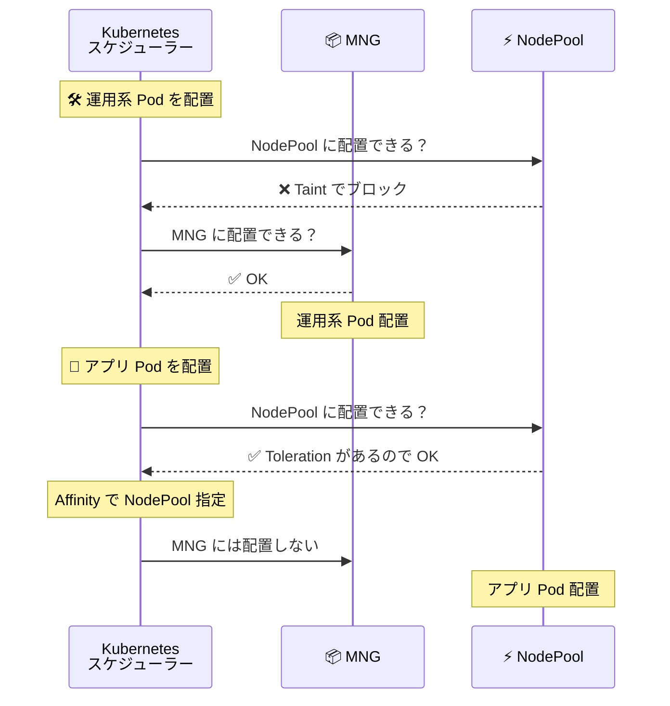

---

## 設定のまとめ

最後に、全体の設定を表で整理します。

### サーバー側の設定

| サーバー種類 | Taint 設定                  | 効果                      |
| ------------ | --------------------------- | ------------------------- |
| 📦 MNG       | なし                        | 運用系 Pod が配置される   |
| ⚡ NodePool  | `limited-to-service` を付与 | アプリ Pod のみ配置される |

### Pod 側の設定

| Pod 種類      | Toleration 設定             | Affinity 設定   | 配置先   |
| ------------- | --------------------------- | --------------- | -------- |
| 🛠️ 運用系 Pod | なし                        | なし            | MNG      |
| 🚀 アプリ Pod | `limited-to-service` を許可 | NodePool を指定 | NodePool |

### 配置ルールの全体図

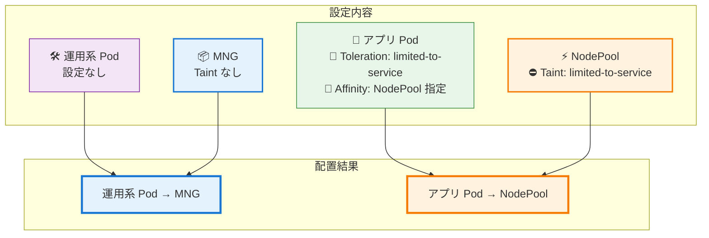

---

## よくある質問

### Q1: Toleration だけじゃダメなの?

**A:** ダメです。

Toleration は「**入れる**」だけで、「**そこに行く**」とは限りません。

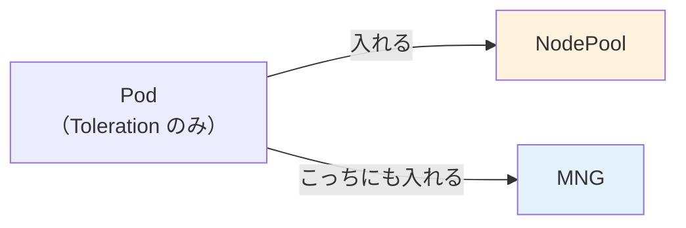

**Affinity を追加すると**

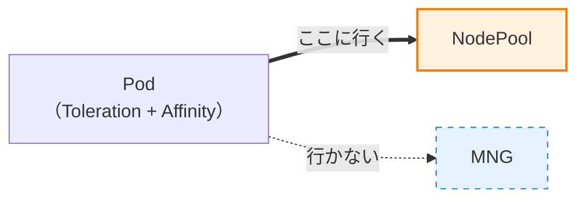

---

### Q2: Affinity だけじゃダメなの?

**A:** ダメです。

NodePool に Taint がついているので、Toleration がないと「**入れない**」です。

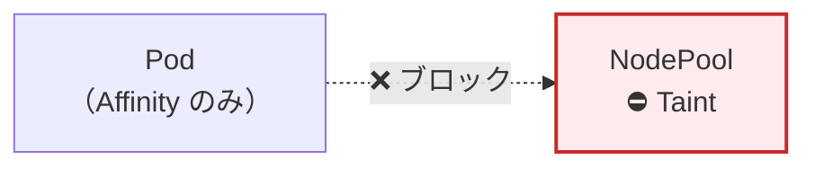

---

### Q3: 運用系 Pod に Toleration をつけたらどうなる?

**A:** NodePool にも配置される可能性があります。

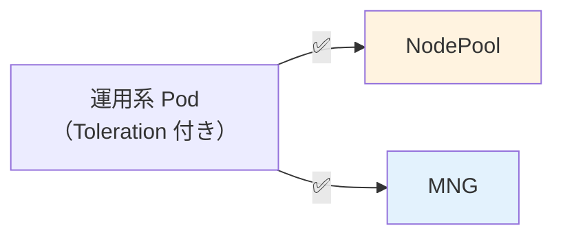

**Affinity がないので、どちらにも配置される可能性があります。**

運用系 Pod は MNG に固定したいので、**何も設定しない**のが正解です。

---

## まとめ

本記事では、Kubernetes で Pod を狙った場所に配置する方法を図解しました。

### ポイントのおさらい

| 仕組み            | 設定場所 | 役割                       | 例え               |
| ----------------- | -------- | -------------------------- | ------------------ |
| ⛔ **Taint**      | サーバー | 「立入禁止」看板           | 「会員限定」の看板 |
| 🎫 **Toleration** | Pod      | 「許可証」（入れる）       | 会員証             |
| 📍 **Affinity**   | Pod      | 「配置指定」（そこに行く） | 部屋の予約         |

### 実装の流れ

1. **NodePool に Taint 付与** → 運用系 Pod の侵入をブロック
2. **アプリ Pod に Toleration 付与** → NodePool に入れるようにする
3. **アプリ Pod に Affinity 付与** → NodePool に行くように指定

### 最終的な配置

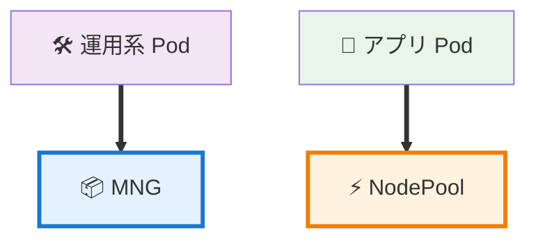

この方法を使えば、Pod を意図した場所に確実に配置でき、コスト削減と安定運用を両立できます。

## 参考資料

- [Kubernetes - Taints and Tolerations](https://kubernetes.io/docs/concepts/scheduling-eviction/taint-and-toleration/)
- [Kubernetes - Assigning Pods to Nodes](https://kubernetes.io/docs/concepts/scheduling-eviction/assign-pod-node/)
- [Karpenter - NodePools](https://karpenter.sh/docs/concepts/nodepools/)
