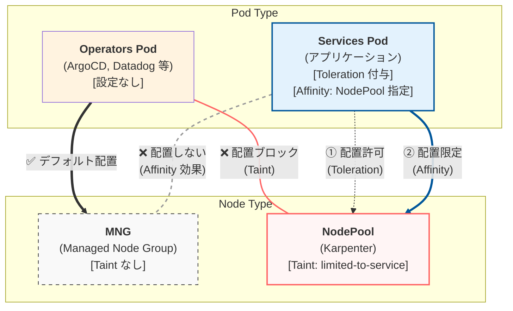

## はじめに

Kubernetes クラスタにおいて、ワークロードの特性に応じて Node を適切に管理し、Pod を意図したノードに配置することは、リソースの最適化やコスト削減、運用効率の向上に繋がります。

本記事では、Operators Pod（ArgoCD、Datadog など）と Services Pod（アプリケーション）を明確に分離し、それぞれを異なるノードグループに配置する方法について解説します。

## 背景と目的

ワークロードを以下の 2 種類に分類し、それぞれ異なる Node で管理する方針とします。

- **Operators Pod**：クラスタ管理やモニタリングなどの運用系ワークロード（ArgoCD、Datadog など）
- **Services Pod**：ビジネスロジックを担うアプリケーションワークロード

この分離により、以下のメリットが得られます。

- リソースの最適化とコスト削減
- 運用の複雑さの軽減
- ワークロード特性に応じた適切なノード管理

## 前提知識

### Node への Pod スケジューリング制御方法

#### Affinity (Pod)

- **対象**：Pod
- **効果**：特定の Node へのスケジューリングを制限したり、優先させる

#### Taint (Node) と Toleration (Pod)

- **対象**：
  - **Taint**：Node
  - **Toleration**：Pod
- **効果**：
  - **Taint**：基本的に Pod のスケジューリングを拒否する（セキュリティゲートのイメージ）
  - **Toleration**：Taint がついた Node へスケジュール可能にする（許可証のイメージ）

Taint と Toleration の組み合わせにより、「許可証（Toleration）を持つ Pod のみがセキュリティゲート（Taint）を通過できる」という制御が実現できます。

### Pod のスケジュール方針

- **Operators Pod**：MNG（マネージドノードグループ）にのみ配置
- **Services Pod**：NodePool（Karpenter）にのみ配置

### Node 管理の特性

| Node 管理                       | YAML 管理 | Taint 付与 |
| ------------------------------- | --------- | ---------- |
| MNG（マネージドノードグループ） | 不可 ❌   | なし ❌    |
| NodePool（Karpenter）           | 可能 ✅   | 付与 ✅    |

### Pod 管理の特性

| Pod 種類      | Toleration, Affinity 付与 | 備考                                               |
| ------------- | ------------------------- | -------------------------------------------------- |
| Operators Pod | なし ❌                   | Operator が増えるたびに個別設定が必要              |
| Services Pod  | 付与 ✅                   | Deployment カスタムテンプレートで<br/>自動付与可能 |

## 配置戦略の全体像

### Node と Pod の管理方針

| Node × Pod              | Node 管理     | Pod 管理                     | Pod 配置（スケジューリング）                                                                                                                                         |
| ----------------------- | ------------- | ---------------------------- | -------------------------------------------------------------------------------------------------------------------------------------------------------------------- |
| MNG × Operators Pod     | Taint なし ❌ | Toleration, Affinity なし ❌ | 制御なし（デフォルト配置）                                                                                                                                           |
| NodePool × Services Pod | Taint 付与 ✅ | Toleration, Affinity 付与 ✅ | - Taint：Operators Pod → NodePool への配置をブロック<br/>- Toleration：Services Pod → NodePool への配置を許可<br/>- Affinity：Services Pod → NodePool への配置を限定 |

### Pod のスケジューリング動作

#### Operators Pod の動き

- **方針**：MNG にのみスケジューリング
- **スケジューリング**：
  - → NodePool：NodePool の Taint でブロック ❌
  - → MNG：デフォルトで配置 ✅

#### Services Pod の動き

- **方針**：NodePool にのみスケジューリング
- **スケジューリング**：
  - → NodePool：Toleration で許可、Affinity で限定 ✅
  - → MNG：Affinity によりスケジューリングされない ❌

### アーキテクチャ図



## 実装方法

### NodePool の設定（Taint の付与）

NodePool に Taint を付与することで、Toleration を持たない Operators Pod のスケジューリングをブロックします。

```yaml
# NodePool 定義
apiVersion: karpenter.sh/v1beta1
kind: NodePool
metadata:
  name: services-nodepool
spec:
  template:
    spec:
      # Taint を付与し、Services Pod 専用にする
      taints:
        - key: "limited-to-service"
          # value は任意（オプション）
          # key のみで十分な場合は省略可能
          # value: "true"
          effect: "NoSchedule"

      # NodePool であることを識別するラベル
      nodeClassRef:
        name: default
```

### Services Pod の設定（Toleration と Affinity）

Services Pod に以下の設定を付与します。

```yaml
# Deployment 定義
apiVersion: apps/v1
kind: Deployment
metadata:
  name: example-service
spec:
  template:
    spec:
      # Toleration: NodePool の Taint を許可
      tolerations:
        - key: "limited-to-service"
          operator: "Exists"
          # Taint に value がある場合は合わせる
          # value: "true"
          effect: "NoSchedule"

      # Affinity: NodePool への配置を限定
      affinity:
        nodeAffinity:
          requiredDuringSchedulingIgnoredDuringExecution:
            nodeSelectorTerms:
              - matchExpressions:
                  # Karpenter NodePool のラベルを指定
                  - key: "karpenter.sh/nodepool"
                    operator: "Exists"
```

### スケジューリングの動作説明

#### Toleration の役割

Toleration は「NodePool にスケジュール**可能**にする」だけです。必ず NodePool に配置されるわけではありません。

```yaml
tolerations:
  - key: "limited-to-service"
    operator: "Exists"
    effect: "NoSchedule"
```

この設定により、Services Pod は Taint のついた NodePool へのスケジューリングが許可されます。

#### Affinity の役割

Affinity は「NodePool に**限定**する」役割を果たします。これにより、Services Pod が MNG にスケジューリングされることを防ぎます。

```yaml
affinity:
  nodeAffinity:
    requiredDuringSchedulingIgnoredDuringExecution:
      nodeSelectorTerms:
        - matchExpressions:
            - key: "karpenter.sh/nodepool"
              operator: "Exists"
```

この設定により、Services Pod は `karpenter.sh/nodepool` ラベルを持つ Node（NodePool）にのみスケジューリングされます。

## まとめ

本記事では、Taint/Toleration と Affinity を組み合わせた Pod 配置戦略について解説しました。

**ポイント**：

- **NodePool に Taint を付与**：Operators Pod の侵入をブロック
- **Services Pod に Toleration を付与**：NodePool へのスケジューリングを許可
- **Services Pod に Affinity を付与**：NodePool への配置を限定し、MNG への配置を防止

この方法により、Operators Pod と Services Pod を明確に分離し、ワークロード特性に応じた適切なノード管理が実現できます。

カスタムテンプレートを活用することで、新規サービスにも自動的にこの配置戦略が適用され、運用負荷を軽減できます。

## 参考資料

- [Kubernetes - Taints and Tolerations](https://kubernetes.io/docs/concepts/scheduling-eviction/taint-and-toleration/)
- [Kubernetes - Assigning Pods to Nodes](https://kubernetes.io/docs/concepts/scheduling-eviction/assign-pod-node/)
- [Karpenter - NodePools](https://karpenter.sh/docs/concepts/nodepools/)
